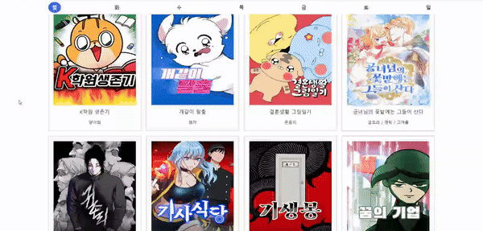
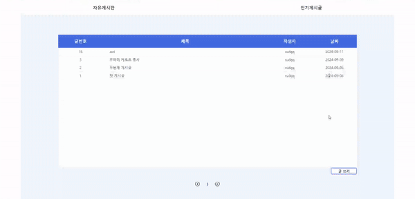
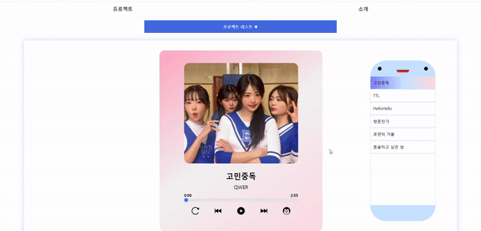

<h2>MewToon</h2>
<h4>
  배포 링크 : https://mewtoon.netlify.app/
</h4>

  MewToon은 웹툰에 어울리는 노래를 추천하고 싶다는 아이디어를 통해 제작하였습니다. react와 typescript를 사용하고 styled-component로 디자인/퍼블리싱을 진행한 프로젝트입니다. 웹툰의 정보는 korea-webtoon-api 에서 가져왔으며 게시판과 로그인은 firebase 통신을 이용해 제작하였습니다. 평소 많은 애니메이션을 만들어보고 싶다는 생각이 있어 모든 css 애니메이션을 직접 제작하였으며 음악, 그림, 보고서 등 일상에 유용한 기능들을 제작한 가벼운 프로젝트들을 프로젝트 페이지에 넣어서 관리하였습니다.

 

<h2>인트로</h2>

  display flex와 position, transtion 및 animation의 높은 이해도로 인트로를 직접 제작하였습니다.

 

<h2>메인 화면</h2>

  메인화면은 스크롤한 위치에 따라 실행되도록 제작하였습니다. 공통함수에 모든 스크롤 함수를 정리하여 많은 화면에서 재사용 할 수 있게끔 만들었습니다. 첫번째 화면은 react-carousel을 사용하였는데, 커스텀이 어렵다는 단점이 있었습니다. 그래서 3번째 화면에 웹툰을 누르면 이동하는 캐러셀은 transtion을 이용해 직접 제작해보았습니다.

 

<h2>로그인</h2>

  로그인 화면은 firebase를 사용해 만들었고 react-query를 이용해 통신을 진행하였습니다. jwt토큰을 이용해 구현하려 하였으나 firebase는 자체적 ID 토큰이 있어서 firebase ID 토큰으로 구현하였습니다. 전달받은 토큰은 로컬스토리지에 저장하였습니다. 회원가입, 로그인, 예외처리가 발생할 경우 react-toastify 로 메시지를 주어 좋은 UI를 만들었습니다.

 

<h2>웹툰</h2>

  웹툰의 정보는 korea-webtoon-api에서 axios 통신으로 가져왔습니다. 초기에 cors오류가 발생해 문제가 발생하여 문제가 있었지만 잘 해결하였습니다. 애니메이션에 공을 많이 들였으며 웹툰이 회전한 후 상세 정보를 표시하는 부분은 onMouteEnter과 onMouseLeave 이벤트를 통해 배열 state에 웹툰 id를 전달하여 구현하였습니다. 웹툰 상세 정보에 대한 데이터가 없어 가데이터를 넣은게 아쉬운 파트입니다.

 

<h2>firebase를 통한 글쓰기</h2>

  firebase와 react-query를 사용한 CRUD를 구현하였습니다. 디자인의 경우 pc 인스타그램의 댓글 부분에서 영감을 받아 제작하였습니다. firebase관련 함수를 공통 함수로 만들려고 노력하였습니다. 타입스크립트의 타입 오류가 많았던 부분이 어려웠습니다.

 

<h2>뮤직 플레이어</h2>

  audio 태그를 사용해 만든 음악 플레이어입니다. 삼성 music에 영감을 받아 제작하였으며 노래 시작, 일시정지, 초기화, 이전곡, 다음곡, 랜덤노래시작 기능을 제작하였습니다. audio 태그에 대해 많이 알아본 파트였습니다.

 

<h2>그림 그리기</h2>

  canvas 태그를 사용해 만든 그림 그리기입니다. 그리기, 색깔, 초기화, 그린 그림을 저장하는 기능을 구현하였습니다. 색깔 변경시 화면이 리렌더링 되는 문제가 있었는데, 화면을 리렌더링 하지 않는 특성을 가진 ref를 이용해서 해결했습니다.

 

<h2>카카오맵</h2>

 기본적인 카카오맵과 특정 좌표에 마커 표시, 선택한 좌표로 지도 이동 기능을 제작해보았습니다.

